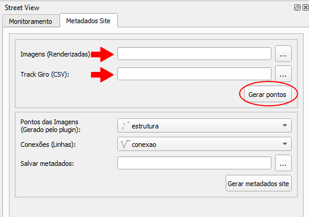

# **STREET VIEW GOPRO**

### **FOTOS**

1. As fotos foram realizado usando uma caminhonete, bastão de selfie, fita tape, câmera Gopro Fusion, computador e GPS.

2. Antes de executar as fotográfias foi feito um teste de consumo de bateria da câmera para ver quanto tempo leva para o consumo de 1% da mesma. E, foi feito o mesmo teste para o armazenamento.

3. A câmera foi fixa no bastão de selfie, que estava no centro da grade vigia da caminhonete preso com uso de fita tape.

4. Foi utilizado para orientar todo o trajeto o QGIS, uma imagem de satélite da região e o GPS.
    > **Note:**
    > É necessário fazer um planejamento dos trajetos para evitar duplicar caminhos.

5. Durante o trabalho a câmera estava no modo de foto por lapso de tempo de 0,5 segundos. A velocidade da caminhonete ficou em média 35 km por hora.

### **PROCESSAMENTO**
    
1. Rederizar as imagens Fisheye gerada pela câmera.
    
    > No meu caso eu fiz uso da câmera gopro fusion e usei o Fusion Studio 1.3.

2. a pasta "street_view_plugin" é um plugin do Qgis criado para auxiliar na criação dos metadados para o site. Diante disso, após instalarmos vamos utiliza-lo da seguinte forma:

    > **Note:**
    > Vale destacar que há vários problemas que podem surgi que depende de análise e correção manual.

    1. Selecione o plugin.

        

    2. Selecione a pasta com as imagens renderizadas e o .csv com os dados do GPS e clicar em "Gerar pontos".

        

        > **Atenção:**
        > Esse arquivo .csv dos dados do GPS foi uma adaptação que foi feita, pois a Gopro Fusion no modo fotografia por lapso de tempo ela não registra o giroscópio na image. Por isso, foi utilizado um GPS durante as fotografias para captura o giroscópio.

    3. O passo anterior vai gerar a malha de pontos das fotografias realizando algumas limpezas de caminhas duplicados, distância e mergeando alguns dados, por exemplo, o giroscópio do GPS.

        

        > **Note:**
        > A camada de pontos gerada tem um estilo baseado em cor que informa o conjuto de fotos por faixa.

    4. Criar camada do tipo geométrico linha para realizar as conexões das faixas de imagens

        

        

    5. Após o passo anterior haverá as seguintes camadas:
        
        

        > **Atenção:**
        > No final de tudo é importante salvar esse projeto para que futuras modificações sejam rápidas.

    6. Agora deverá ser feito a conexão entre as faixas das imagens. Cada linha deve ter apenas dois pontos de conexão:

        > **Note:**
        > É importante utilizar uma imagem de satélite da área fotografada para confirma se há realmente uma conexão.

        

    6. Agora deverá ser gerado os metadados que seram utilizados no site. Para isso, basta selecionar os pontos de imagem, as conexões, uma pasta de saída e clicar em "Gerar metadados site":

        

### **SITE**

1. Converter as imagens para o formato .webp:
    
    [Tutorial para conversão](https://www.tecmint.com/convert-images-to-webp-format-in-linux/)

    > **Note:**
    > Esse formato diminui em média 10MB por imagem no conjunto de 10.012 imagens que usei proporcionou uma economia de aproximadamente 100GB.

2. a pasta "site" contém um site para navegar nas imagens. Crie uma pasta "IMG_CAMPO" e coloque todas as imagens e uma pasta "METADATA_CAMPO" e coloque os metadados gerados na seção anterior.

3. Por fim, sirva o site com a lançador de sua escolha.

    > **Note:**
    > Eu tinho o python3 instalado na minha máquina e utilizei o seguinte comando para lançar o site:
    ```
    $ cd site
    $ python3 -m http.server
    ```

    

    
    

